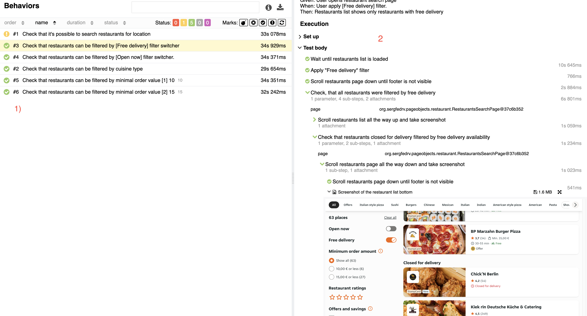
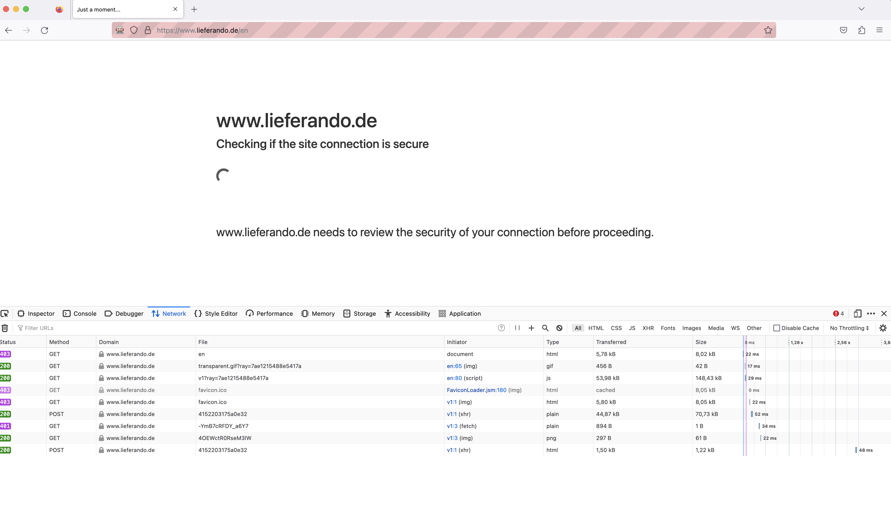
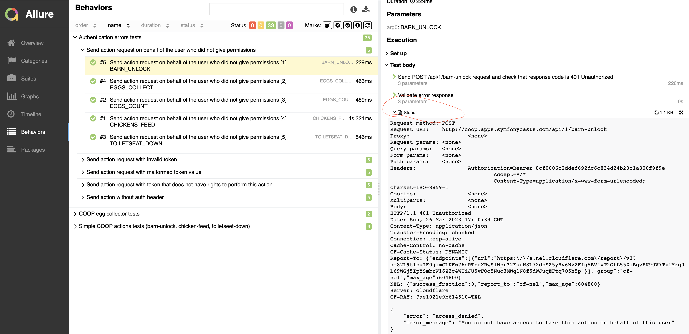

# JET test automation task
## Before you started
* Make sure that JDK 17 is installed
* Make sure that Chrome browser is installed
## UI Tests
### Launch properties
Test configuration properties are located in /ui_tests/gradle.properties file.
```
systemProp.browser=chrome
systemProp.remote_driver_url=http://localhost:4444/wd/hub
systemProp.base_url=https://www.lieferando.de/en/
systemProp.restaurant_search_url=delivery/food/berlin-13089/
systemProp.base_api_url=https://cw-api.takeaway.com/api/v33/
systemProp.search_postal_code=13089
```
Properties possible values
* `browser` - either "chrome" or "grid_chrome"
* `remote_driver_url` - if you want to launch tests on Selenium grid, set `systemProp.browser=grid_chrome` and set up Selenium Grid url
* `restaurant_search_url` - predefined page with restaurant search results. (Read section ___Cloudflare issues___ for details)
* `base_api_url` - Api URL for retrieving actual restaurant data (For example for checking what food types are available for a given restaurant)
* `search_postal_code` - Location postal code that is used for API request
### Launch instructions
* Clone the repository and navigate to the jet_test_automation_task/ui-tests
* Launch tests with the command `./gradlew clean uiTests` for Unix or `gradlew.bat clean uiTests` for Windows
* For running tests in parallel mode, use Gradle task `uiTestsParallel` 
* To generate test report execute either `./gradlew allureServe` or `./gradlew clean uiTests`
  * If you launch `./gradlew allureServe`, the report will be opened in your browser automatically.
  * If you launch `./gradlew allureRepoer`, you can find and open the report in /ui-tests/build/reports/allure-report/allureReport/ directory.
### Allure report navigation
* Open Allure report as described in Launch instructions
* Open "Behaviours" tab on the page left panel.
* Choose any of the tests from the list in the middle of the page.
* Expand all test steps on the right-hand side of the report page and check browser screenshots and step descriptions.
* You should see something like this:
  
### Why do I need API calls in UI tests?
When you open the restaurant search page and choose for example "Italian" food category, there are no clear indicators in 
restaurant list items that can be used in the test script to check that this is really an Italian restaurant. 
So I decided to implement the following algorithm in the test.
* Load actual restaurant info in @BeforeAll from the backend for the location chosen for the test with `GET https://cw-api.takeaway.com/api/v33/restaurants?postalCode=13089`
* Open the search page and choose the "Italian" category.
* Read names of the restaurants in the list and check their cuisine info in actual restaurant info loaded from the backend
### Cloudflare issues
When Selenium test opens https://www.lieferando.de/, Cloudflare site protection comes into play. 
Because of that, it is impossible to fill search address and navigate to the restaurant search page using Selenium. I had to use the "hardcoded" search 
result URL to avoid that. I tried several technics in order to avoid Cloudflare protection, but in the end of the day, I decided to give up on that.
This is what Cloudflare is for after all - to protect sites like www.lieferando.de from automated scripts, including Selenium tests.
Please take a look at the test "Check that it's possible to search restaurants for location" in the report. If you expand 
__After all__ section of the report, you may find browser console logs that look like this.
```
Sun Mar 26 17:36:48 CEST 2023 SEVERE https://www.lieferando.de/consumer-web/app/10/_next/static/chunks/tkwy-common-location.765f9ba0012239ce6eca.js - Failed to load resource: the server responded with a status of 403 ()
```
I figured out that these errors come from the Cloudflare server when browser is being controlled by Selenium. With Firefox 
driver even the "hardcoded" URL's won't open. (Please see screenshot below)


## API tests
### Launch properties
Test configuration properties are located in /api_tests/gradle.properties file.
```
systemProp.baseUrl=http://coop.apps.symfonycasts.com/
systemProp.userId=4414
systemProp.fullScopeApp.clientId=JETTestTaskApp
systemProp.fullScopeApp.clientSecret=a6b5ae541edb2219b777ef1fd7ef56f7
systemProp.emptyScopeApp.clientId=JETTestTaskNoRightsApp
systemProp.emptyScopeApp.clientSecret=5258380a5b66ba357bfed8e6c121e476
systemProp.debugMode=enabled
```
I created two apps for these tests, one with the full scope of permissions and another with empty.
It is not the best idea to store client credentials in plain text, I know that, but I assume that in the real world CI env,
secret variables will be stored somewhere else (for example in [Vault](https://docs.gitlab.com/ee/ci/secrets/))
and will be passed to test the launch script.
When `systemProp.debugMode=enabled`, tests logs all request information (including auth requests and headers with auth tokens)
It might be useful for test debugging, I assume that in CI tests should not be launched in debug mode. 
### Launch instructions
Pretty much the same as for UI tests
* Navigate to /api_tests
* Launch tests with the command `./gradlew clean apiTests` for Unix or `gradlew.bat clean apiTests` for Windows
* For running tests in parallel mode, use Gradle task `apiTestsParallel`
* Use `./gradlew allureServe` for test report generation
### Allure report navigation
The same as in UI tests. Please note, that request logs are available for every test as stdout attachments of the test (see screenshot below)

